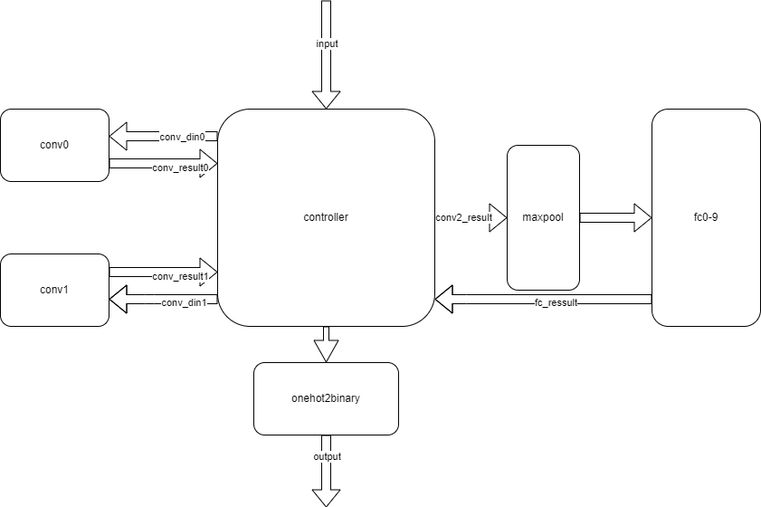

# 设计文档  
## 系统架构  
系统架构如图所示  
  
### 卷积模块  
卷积由滑窗部分和五级流水线组成，滑窗模块从左到右，从上到下依次读取，在读取三行过后即可同步前三行的第一列像素点，接下来的两个周期会同步第一个卷积核需要的像素点，经过五级流水线过后，会输出第一个计算完成的像素点，此后，每个周期输出一个有用的像素点，同时输出对应的有效信号。  
### 全连接模块  
全连接模块接收到有效信号过后，将输入与tb里面读取的权重做同或操作，暂存于内部寄存器当中，当接受了12*12*4个元素过后，全连接输出有效。  
### 最大池化模块  
最大池化模块在计算第二层时启动，在行数为偶，且列数为偶时输出有效，输出值作为全连接模块的输入。  
###  控制模块  
controller接收卷积的输出及其有效信号，同时控制fmap中的数据读写，控制maxpool的启动，在全连接输出有效时，对比输出值的大小，输出对应的独热码。  
### 独热码转二进制模块  
考虑到端口的数量不够，进行独热码转二进制的操作，当controller输出的独热码有效时，进行二进制编码。  
